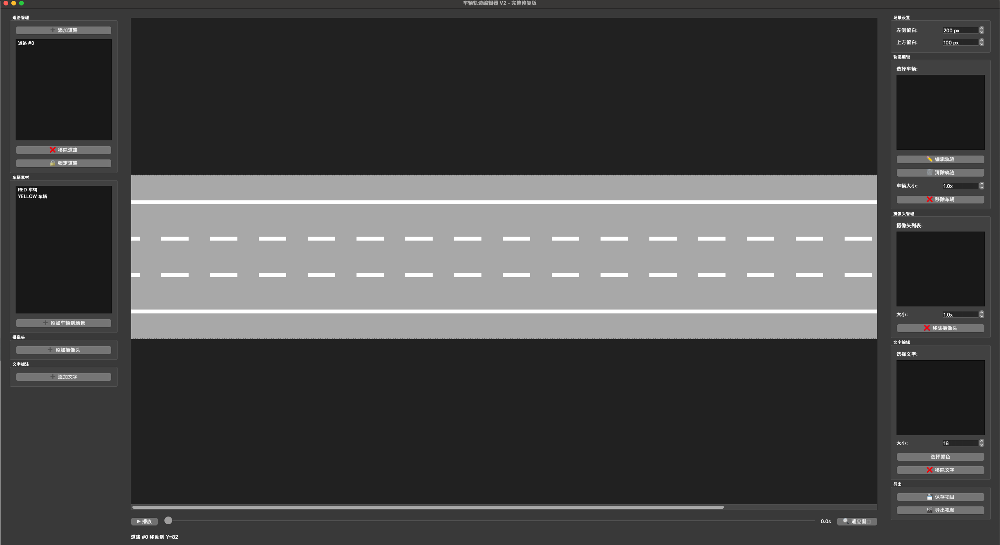
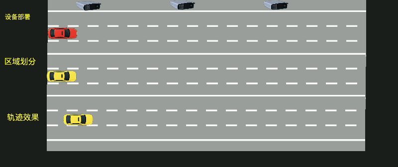

# Traffic Scenario Builder

A Python-based GUI tool for creating simple traffic scenarios, visualizing vehicle trajectories, and deploying simulated cameras. Built with PyQt6 and OpenCV.



### Demo



## Features

*   **Interactive Application**: Not just a script, but a full GUI application.
*   **Road Customization**: Add, move, remove, and lock individual road lanes. Customizable margins (Left/Top) to fit your layout.
*   **Vehicle Trajectory Planning**:
    *   Add vehicles (Red/Yellow cars) to the scene.
    *   Interactive trajectory editing: Click to set waypoints with precise timestamps and pause durations.
    *   Automatic linear interpolation between points.
    *   **Auto-Scaling**: Vehicles are automatically scaled (0.5x) to fit lanes, with manual override.
*   **Camera Deployment**:
    *   Deploy surveillance cameras to the scene.
    *   **Scale Control**: Adjust camera size (0.1x - 5.0x) to simulate different heights/perspectives.
*   **Visual Assets**: Includes transparency-optimized assets for cars and cameras.
*   **Animation & Export**:
    *   Real-time playback of defined trajectories.
    *   Export the entire scenario as an MP4 video file.
*   **Export/Import**: Save and load your project state (JSON format).

## Requirements

*   Python 3.8+
*   PyQt6
*   OpenCV (`opencv-python`)
*   NumPy

## Installation

1.  Clone the repository:
    ```bash
    git clone https://github.com/YOUR_USERNAME/traffic-scenario-builder.git
    cd traffic-scenario-builder
    ```

2.  Install dependencies:
    ```bash
    pip install -r requirements.txt
    ```

## Usage

1.  Run the editor:
    ```bash
    python3 vehicle_editor_fixed.py
    ```

2.  **Basic Workflow**:
    *   **Add Road**: Click "Add Road" to create lanes. Lock them when positioned correctly.
    *   **Add Vehicle**: Select a vehicle type and click "Add Vehicle to Scene".
    *   **Edit Trajectory**: Select the vehicle, click "Edit Trajectory", and click on the canvas to set path points.
    *   **Add Camera**: Place cameras to simulate monitoring viewpoints.
    *   **Play**: Hit "Play" to preview the traffic flow.
    *   **Export**: Use "Export Video" to generate an MP4 file.

## Project Structure

*   `vehicle_editor_fixed.py`: Main application entry point.
*   `assets/`: Directory containing vehicle, road, and camera images.
*   `requirements.txt`: Python dependencies.

## License

MIT License
